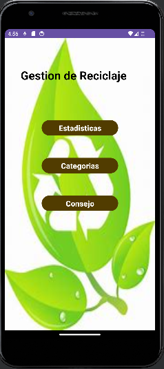

# Sistema de Gestión de Reciclaje ("EcoRecicla")

**EcoRecicla** es un sistema diseñado para permitir a los usuarios registrar y hacer seguimiento de sus actividades de reciclaje en diferentes categorías de materiales, como plástico, papel, vidrio, entre otros. El sistema calcula y muestra estadísticas sobre el reciclaje y proporciona consejos para mejorar las prácticas de reciclaje.

## Funcionalidades

- **Registro de reciclaje**: Los usuarios pueden registrar sus actividades de reciclaje en varias categorías de materiales.
- **Seguimiento de estadísticas**: El sistema calcula y muestra estadísticas como la cantidad promedio reciclada, comparativas entre períodos y otros datos útiles.
- **Consejos personalizados**: EcoRecicla proporciona recomendaciones para aumentar el reciclaje en función de los datos registrados.

## Vistas Sugeridas

### 1. Pantalla de Inicio de Sesión
- **Descripción**: Permite a los usuarios iniciar sesión en el sistema utilizando sus credenciales o registrarse como nuevos usuarios.

-

### 2. Pantalla Principal
- **Descripción**: Muestra la navegación para acceder a las diferentes secciones del sistema, como las categorías, estadísticas y consejos.

-

### 3. Pantalla de Categorías
- **Descripción**: Permite al usuario seleccionar la categoría de material que desea registrar y hacer seguimiento, como plástico, papel, vidrio, etc.

-

### 4. Pantalla de Registro
- **Descripción**: Permite al usuario ingresar los datos de reciclaje para una categoría específica, como la cantidad de kilogramos de plástico reciclados, el número de hojas de papel recicladas, el valor ganado en cada categoría y el mes correspondiente.

-

### 5. Pantalla de Estadísticas
- **Descripción**: Muestra estadísticas detalladas sobre el reciclaje, incluyendo la cantidad promedio, máxima y mínima reciclada para una categoría específica.

-

### 6. Pantalla de Consejos
- **Descripción**: Proporciona consejos y recomendaciones personalizadas para aumentar el reciclaje en función de los datos registrados por el usuario.

-
